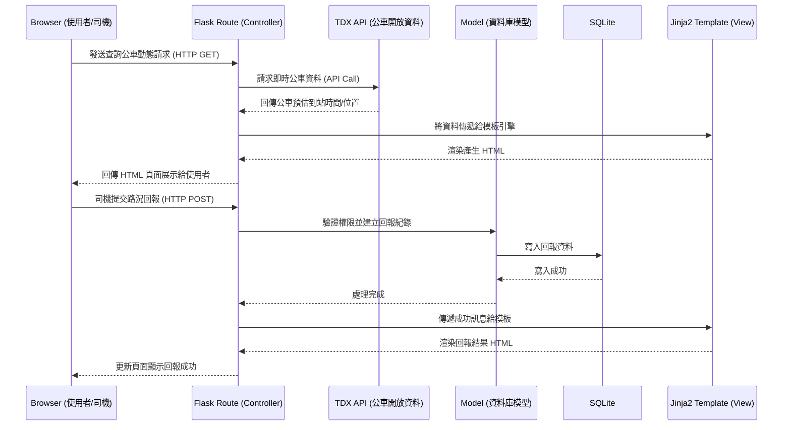

# 系統架構文件：台中等公車2.0

本文件基於「台中等公車2.0」PRD 需求，說明系統的技術架構設計、專案資料夾結構、元件間的互動關係及關鍵設計決策。

## 1. 技術架構說明

### 選用技術與原因
- **後端框架：Python + Flask**
  - **原因**：Flask 輕量且彈性高，適合快速開發與建立 API 原型。對於本專案包含公車查詢、路線規劃與司機回報等需求，Flask 可以有效管理路由與業務邏輯。
- **模板引擎：Jinja2**
  - **原因**：Flask 內建支援 Jinja2，能直接在伺服器端將動態資料（如公車到站時間、站牌資訊）渲染成 HTML，不需建置複雜的前端框架（例如 React/Vue），降低開發門檻。
- **資料庫：SQLite**
  - **原因**：無需額外架設伺服器，直接以單一檔案（`database.db`）存放資料。適用於存放司機帳號、回報紀錄、使用者收藏站牌等輕量級關聯資料。
- **前端呈現：HTML / CSS / JavaScript**
  - **原因**：搭配 Jinja2 渲染畫面，並利用少量的 JavaScript 來處理即時查詢、公車動態更新與使用者互動。

### Flask MVC 模式說明
專案將遵循 MVC（Model-View-Controller）設計模式的變體進行開發：
- **Model (資料模型)**：負責定義資料庫結構與資料存取邏輯。例如處理公車司機帳號、回報狀態紀錄等，與 SQLite 資料庫直接互動。
- **View (視圖)**：負責呈現使用者介面。由 Jinja2 模板 (HTML) 與靜態資源 (CSS/JS) 組成，將 Controller 傳來的資料顯示給使用者。
- **Controller (控制器)**：由 Flask 的路由 (Routes) 擔任。負責接收瀏覽器的請求，呼叫 Model 取得或寫入資料，或是打 API 向開放資料平台（如 TDX）請求即時公車數據，最後將資料傳給 View 進行渲染。

## 2. 專案資料夾結構

以下為建議的專案資料夾結構，以模組化的方式分離不同職責：

```text
taichung-bus-2.0/
├── app.py                  # 專案入口點，負責啟動 Flask 伺服器與初始化設定
├── config.py               # 存放環境變數、資料庫連線字串、API 金鑰等設定檔
├── requirements.txt        # 紀錄專案所需的 Python 套件 (如 flask, requests 等)
├── app/                    # 應用程式主目錄
│   ├── __init__.py         # 將 app 標記為 Python 套件，並包含 Flask 實例建立函式
│   ├── models/             # [Model] 資料庫模型
│   │   ├── __init__.py
│   │   ├── driver.py       # 司機帳號與權限模型
│   │   └── report.py       # 司機回報紀錄模型
│   ├── routes/             # [Controller] 處理請求與業務邏輯
│   │   ├── __init__.py
│   │   ├── main.py         # 處理首頁、附近站牌與路線規劃路由
│   │   ├── bus.py          # 處理公車即時動態查詢相關路由
│   │   └── driver.py       # 處理司機登入與即時回報路由
│   ├── templates/          # [View] HTML 模板 (Jinja2)
│   │   ├── base.html       # 共用版型 (包含導覽列、頁尾)
│   │   ├── index.html      # 首頁 (搜尋框、附近站牌)
│   │   ├── bus_status.html # 公車即時動態顯示頁面
│   │   └── driver.html     # 司機回報系統介面
│   └── static/             # 靜態資源檔案
│       ├── css/
│       │   └── style.css   # 客製化樣式，包含黑夜模式設計
│       ├── js/
│       │   └── main.js     # 前端互動邏輯 (如 AJAX 呼叫、智慧下車提醒邏輯)
│       └── images/         # 網站圖片、Logo 或圖示
└── instance/
    └── database.db         # SQLite 資料庫檔案 (不應提交至版控)
```

## 3. 元件關係圖

以下使用 Mermaid 語法展示系統各元件的資料流與關係：



## 4. 關鍵設計決策

1. **整合開放資料 API (不自行建立龐大的公車資料庫)**
   - **原因**：公車動態與路線資訊變動頻繁且資料量大，自行爬蟲或維護不僅成本高且容易失去準確性。透過串接交通部 TDX (或台中市政府) 提供的即時 API，可以在每次使用者查詢時抓取最新資料，確保資訊即時性。
   
2. **採用 Server-Side Rendering (SSR) 搭配輕量 AJAX**
   - **原因**：為了減輕前端負擔並加快首屏載入速度，頁面架構與初始資料會由 Flask 加上 Jinja2 在伺服器端渲染好。針對「即時公車動態」與「下車提醒」等需要頻繁更新的功能，再透過前端 JavaScript 以 AJAX 定期向 Flask 請求新資料並局部更新畫面。

3. **司機回報系統與一般使用者介面分離**
   - **原因**：司機在使用回報功能時，需要簡單、按鈕大、且操作極快的介面。將其獨立為專屬的路由（如 `/driver`）與模板，並實作簡單的 Session 驗證，可以避免複雜的畫面影響司機操作，確保行車安全與資料可靠性。

4. **使用 SQLite 作為主要資料庫**
   - **原因**：本專案的核心在於「顯示即時動態」（依賴外部 API），需要儲存的資料主要是司機帳號、回報紀錄、或者未來擴充的「使用者收藏站牌」。資料規模小、關聯性簡單，使用 SQLite 便足以應付，並大幅減少系統部署的複雜度。
