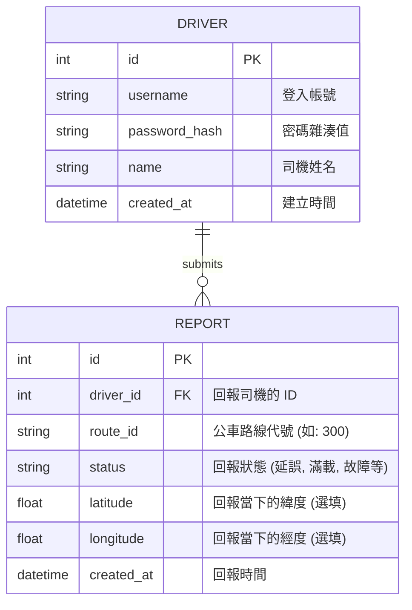

# 資料庫設計文件：台中等公車2.0

本文件說明「台中等公車2.0」的 SQLite 資料庫設計，主要用於儲存司機帳號與其回報的公車狀態紀錄。公車路線與站牌資料則直接取自 TDX 外部 API。

## 1. ER 圖（實體關係圖）

## 2. 資料表詳細說明

### 2.1 DRIVER (司機資料表)
用途：儲存公車司機的帳號與驗證資訊。
| 欄位名稱 | 型別 | 必填 | 說明 |
| --- | --- | --- | --- |
| `id` | INTEGER | 是 | Primary Key，自動遞增 |
| `username` | TEXT | 是 | 司機登入帳號，必須唯一 |
| `password_hash` | TEXT | 是 | 經過雜湊處理的密碼，確保安全性 |
| `name` | TEXT | 是 | 司機姓名或代稱 |
| `created_at` | DATETIME | 否 | 帳號建立時間（預設 CURRENT_TIMESTAMP） |

### 2.2 REPORT (回報紀錄表)
用途：儲存司機即時回報的路況、車況等資訊。
| 欄位名稱 | 型別 | 必填 | 說明 |
| --- | --- | --- | --- |
| `id` | INTEGER | 是 | Primary Key，自動遞增 |
| `driver_id` | INTEGER | 是 | Foreign Key，對應 DRIVER 表的 id |
| `route_id` | TEXT | 是 | 目前行駛的公車路線代號（例如 "300"） |
| `status` | TEXT | 是 | 回報狀態，例如 "延誤", "滿載", "故障" |
| `latitude` | REAL | 否 | 當下 GPS 緯度 |
| `longitude` | REAL | 否 | 當下 GPS 經度 |
| `created_at` | DATETIME | 否 | 回報時間（預設 CURRENT_TIMESTAMP） |

## 3. SQL 建表語法
建表語法已儲存於 `database/schema.sql`，可直接於 SQLite 執行。

## 4. Python Model 說明
在 `app/models/` 目錄下已經實作了使用 `sqlite3` 的 `Driver` 與 `Report` 類別，封裝了對應的 CRUD (新增、查詢、修改、刪除) 方法，方便 Flask Route 進行操作。
