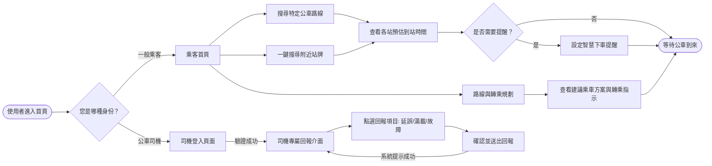
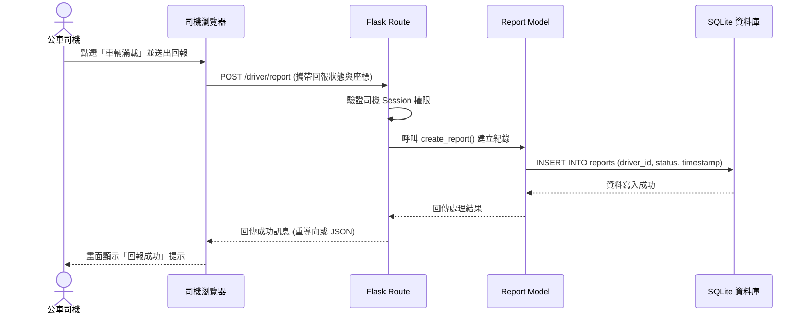
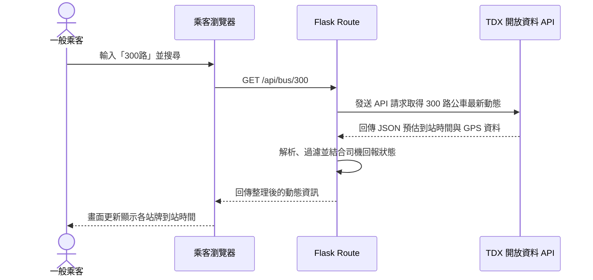

# 流程圖與系統行為文件：台中等公車2.0

本文件基於 PRD 與系統架構設計，使用 Mermaid 語法繪製「使用者流程圖」與「系統序列圖」，並提供對應的功能與 API 路由清單，協助開發團隊釐清系統操作路徑與資料流向。

## 1. 使用者流程圖 (User Flow)

此流程圖描述一般乘客與公車司機進入系統後的完整操作路徑。

## 2. 系統序列圖 (Sequence Diagram)

### 2.1 司機即時回報流程 (寫入資料庫)
描述公車司機透過介面回報車輛狀態，資料經過 Flask 驗證並存入 SQLite 資料庫的完整流程。

### 2.2 乘客查詢即時動態流程 (讀取外部 API)
描述乘客查詢特定路線時，系統向外部 TDX 開放資料平台取得即時資訊的過程。

## 3. 功能清單與路由對照表

以下為系統核心功能對應的 URL 路徑與 HTTP 方法：

| 功能名稱 | URL 路徑 | HTTP 方法 | 說明 |
| --- | --- | --- | --- |
| **乘客首頁** | `/` | GET | 顯示首頁搜尋框與附近站牌按鈕 |
| **路線與轉乘規劃** | `/route-plan` | GET | 提供起迄點輸入與規劃結果呈現 |
| **查詢公車動態頁面** | `/bus/<route_id>` | GET | 顯示特定路線的各站牌預估到站時間與介面 |
| **取得即時動態 API** | `/api/bus/<route_id>` | GET | 前端 AJAX 呼叫，由後端向 TDX 取得最新公車資料 |
| **司機登入頁面** | `/driver/login` | GET | 顯示司機專屬的登入表單 |
| **司機登入驗證** | `/driver/login` | POST | 驗證司機帳號密碼並建立登入 Session |
| **司機回報介面** | `/driver/report` | GET | 顯示適合司機快速操作（大按鈕）的專屬介面 |
| **送出狀態回報** | `/driver/report` | POST | 接收前端送出的回報資料並寫入 SQLite 資料庫 |
